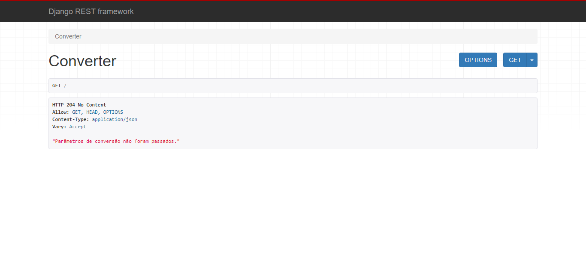
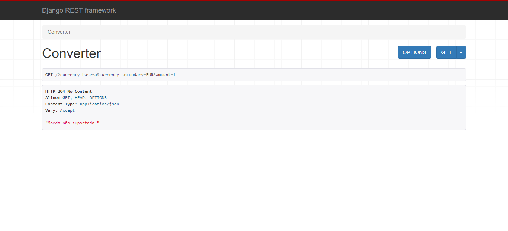
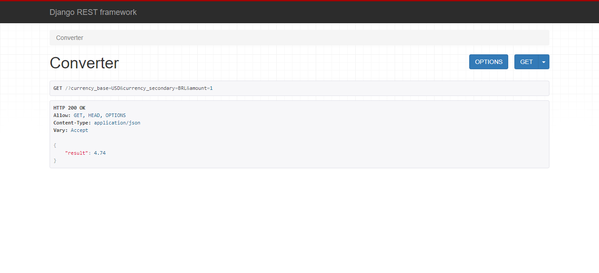

# Currency Converter

## Descrição do projeto
Este projeto foi feito com intuito de estudo entre Django, Django Rest Framework, Requests e BeautifulSoup.🚀

## Tecnologias utilizadas
* Django
* Django Rest Framework
* Requests
* BeautifulSoup

## Status do projeto
Finalizado!

## Features
- [x] Conversão de BRL <-> USD
- [x] Conversão de BRL <-> EUR
- [x] Conversão de USD <-> EUR
  
## Aplicação

## Autor
Feito por Gilson Kedson.